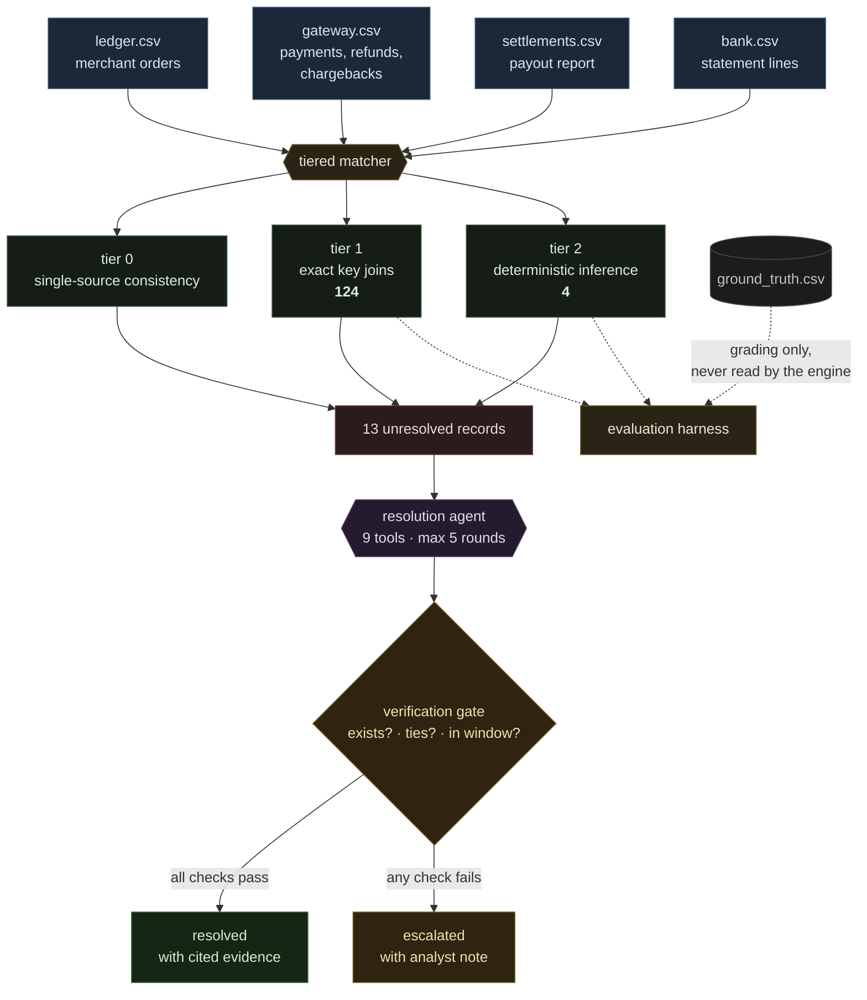

# Three-way payment reconciliation engine

[](https://github.com/rahulpaul-07/Three-Way-Financial-Reconciliation-Engine/actions/workflows/tests.yml)
[](https://github.com/rahulpaul-07/Three-Way-Financial-Reconciliation-Engine/actions)
[](tests/)
[](#results)
[](#results)
[](LICENSE)

**[Live dashboard](https://rahulpaul-07.github.io/Three-Way-Financial-Reconciliation-Engine/)** —
the engine's output as an interactive workbench: where the captured money went,
how every record was settled, a searchable table of every exception with its
path traced across all four sources, the evidence charts, and the agent's
recorded investigations. Pick a bundled batch, generate one, or upload your own
three CSVs. The page reconciles on the live engine when it is awake and falls
back to recorded runs when it is not, and says which. It starts waking the
engine before its own JavaScript has parsed, and a run asked for while the
engine is still starting is held and sent the moment it answers, so nothing
has to be clicked twice.

**[Live app](https://recon-engine-yjim.onrender.com)** — the same dashboard served
by the engine itself, plus the JSON API (`/api/docs`). Hosted on a free tier,
which stops the instance after 15 minutes idle and takes 30 to 60 seconds to
start it again; `.github/workflows/keepalive.yml` pings it every 10 minutes to
avoid that, at the cost of most of the free tier's monthly instance-hours, and
can be deleted if those are worth more than the wait. Reconciliation needs no API key; the
agent and Q&A panels use one, and a visitor can supply their own for a single
request.

**[Static report](https://rahulpaul-07.github.io/Three-Way-Financial-Reconciliation-Engine/report.html)** —
the original self-contained HTML report of the reference run, including the
agent's full investigation trace.

**[Five-minute walkthrough](https://youtu.be/NjFKpmBX1Zk)** — the engine run
end to end, what the confidence tiers mean, where the model sits, and the bug
my own test data was hiding from me.

Reconciles a merchant's order ledger against a payment gateway's transaction
report and the corresponding bank statement. Resolves what it can, records how
certain each resolution is, and reports an honest, categorised list of what it
could not.

## Results

Measured against a ground-truth answer key that the reconciliation engine never
reads.

| | |
|---|---|
| Batch | 120 orders, 141 reconcilable entities |
| Resolved | **90.8%** (95% CI 84.9-94.5%) |
| Classification accuracy | **100.0%** across 14 classes |
| Under compound defects | degrades to 91.9% at 85% defect density, 81.5% when every record is defective |
| Tests | 168; the original suite was verified by mutation, the tests added in this round were not |
| Across 12 independent batches | 92.7% +/- 0.4% resolved, 100.0% +/- 0.0% accuracy |
| Throughput | roughly 230,000-290,000 entities/sec from 141 to 5,022 entities (single runs), linear cost |
| Unseen defect classes | 26/26 planted records flagged, 0 silent passes (was 15/26) |
| Exceptions | 13, each listed with a reason. None dropped. |
| Agent investigation | 13/13 answered, 12/13 agreed with the engine independently (Cohen's κ 0.90) |

**What these numbers do not show.** They measure whether the engine correctly
identifies the defect classes it was designed around, on data generated by the
same author. They are evidence of no false positives and no silently discarded
records. They are not evidence of performance on a real merchant's books, where
defect types this generator does not model would appear.

Some of those types are now measured rather than left to the imagination.
`src/adversarial_data.py` plants defect classes from outside the engine's
original taxonomy, and `python3 src/evaluate.py --data datasets/08-unseen --detection`
scores whether it at least declines to call them clean.

The first run found **four silent passes**: a duplicate bank credit and a
foreign-currency order were classified `clean`, and a dangling settlement
reference and an unreversed refund fee were never examined at all. The
duplicate credit was the sharpest — the same money counted twice reconciled
without a flag. All four now have rules and tests, and two other unseen classes
(split settlements, returned payouts) are now named rather than reported as
orphan credits. Every planted record is flagged, 19 of 26 under their exact
name; CI fails if any class goes silent again.

The honest caveat: the rules were written *after* seeing these defects, so this
batch no longer measures generalisation for them. It is now a regression suite.
Measuring generalisation again needs a fresh round of classes the engine has
not seen.

Reproduce:

```bash
python3 src/generate_data.py --seed 42 --orders 120
python3 src/evaluate.py --data data
python3 src/evaluate.py --seeds 12 --orders 150       # variance across batches
python3 src/evaluate.py --throughput                  # scaling behaviour
python3 src/investigate.py --data data --json agent_traces.json
python3 src/report.py --data data --traces agent_traces.json \
                      --qa qa_answers.json --out report.html
python3 src/ask.py --data data --demo --json qa_answers.json
python3 -m pytest tests/ -q                           # 168 tests
python3 src/evaluate.py --stress --compound --seeds 3 # where it breaks
```

Only `investigate.py` needs a language model. Everything else is deterministic
and runs with no API key.

## The problem

Three systems record the same sale and none of them agree.

The merchant's ledger records the gross amount, Rs 450. The gateway records the
same payment less its fee, Rs 439.38. The bank records a single netted credit
covering an entire day of payments, one or more working days later --
Rs 38,204.55 for 87 orders, with no line items.

None of them is wrong. They describe the same money from three positions under
three different constraints. Refunds flow backwards, chargebacks land in a later
settlement period with a penalty attached, duplicates appear and are voided, and
captures near the end of a window have not been paid out yet and are *correctly*
unmatched.

Reconciling this is still manual work below a certain company size. Stripe
acquired Recko in 2021 to solve it at scale; below that scale it remains a
spreadsheet.

## Architecture



Every resolution records the tier that produced it, so the result is stratified
by confidence rather than reported as one opaque figure.

## Three design stances

**The model proposes; deterministic code verifies.** A language model is used in
two places -- recovering a settlement reference from unstructured bank narration,
and investigating records the deterministic tiers could not resolve. In neither
case does it decide. It nominates candidates and chooses which checks to run;
acceptance always requires that a reference resolve to exactly one known
settlement, that the amount tie exactly, and that the date fall inside the
plausible payout window.

Run `narration.py` with `--no-verify` to see what the gate prevents: two
well-formed references that correspond to nothing are accepted on trust,
fabricating Rs 6,950 of matches and making the books appear to balance while two
genuine breaks disappear.

The gate was built to guard against the language model. It first caught a
*regex* result -- a perfectly well-formed reference that corresponded to nothing.
Extraction succeeding is not the same as the extracted value being correct, and
confidence in the extraction method is irrelevant to that.

**Contested matches are solved jointly, not one at a time.** Where several bank
rows and several settlements are mutually plausible, matching them sequentially
can commit to a pair that a later row needed more. That is the assignment
problem; the Hungarian algorithm solves it in O(n³) and returns a provably
optimal pairing. Implemented directly rather than pulled from a library, and
verified against brute force on 300 random matrices.

The honest claim is narrower than it sounds. Measured across fifteen contested
sets, optimal was **never** better than greedy, because the planted ambiguity
makes settlements share an exact amount and window — so every pairing costs the
same and any assignment is optimal. It is a guarantee that greedy cannot do
worse, not a measured improvement. Kept because in a payments system the
failure mode is a silently wrong match rather than a visible error, and knowing
the ordinary path is safe beats assuming it.

Every pairing the solver proposes is still verified: the amount must tie
exactly and the date must fall inside the payout window. An assignment that is
optimal but does not verify is discarded.

**Ambiguity that cannot be resolved escalates rather than guessing.** Where several settlements share an
amount and a date window, the engine refuses to choose. A wrong match in
financial data is worse than an unmatched record, because it is invisible.

**Constraints live in code, not in the prompt.** The agent is bounded by a step
limit, a closed tool registry, a fixed classification taxonomy, and a rule that
any claimed resolution must cite at least one tool result. A model that invents a
classification outside the taxonomy is downgraded; one that claims a resolution
without calling a tool is overruled. These were tested directly with adversarial
input, without a model in the loop.

## The agent

Records the deterministic tiers cannot resolve are passed to a bounded agent that
selects its own investigation tools. On the reference batch it answered all 13
exceptions and reached the same classification as the deterministic engine on 12
of them, across 44 model calls and 8 distinct tools. No tool ordering or
preference is specified; the distribution below is what it chose.

The agent contributes investigative strategy. The tools contribute truth. It
performs no arithmetic and asserts no relationship a tool has not confirmed. A
model failure degrades an exception into an escalation, never into a wrong number.

**Provider independence.** Seven providers are supported across twenty
provider/model candidates. Failover is per call and scoped by failure kind: a
retired model identifier demotes that model and the next one on the same provider
is tried; an unfunded account or revoked key demotes the whole provider. Each
candidate is attempted once per session rather than retried on every record.

This was rebuilt after a live run in which a valid key with a stale model name
caused the original chain to discard an otherwise working provider. Model
identifiers are a dependency on a vendor's catalogue at a point in time, and
vendors retire models.

## Where it breaks

Raising defect density alone does not degrade accuracy: each record is
classified independently, so more defects of the same kinds change nothing. That
first stress test returned 100% at every density, which was a sign the
experiment was wrong rather than a good result.

Defects that *interact* do degrade it. Allowing several defects on one record:

| Planted defect rate | Records defective | Classification accuracy |
|---|---|---|
| ×1 | 35% | 99.7% |
| ×2 | 56% | 97.5% |
| ×3 | 73% | 96.1% |
| ×4 | 85% | 91.9% |
| ×6 | 100% | 81.5% |

Mean of three seeds at 120 orders, from
`python3 src/evaluate.py --stress --compound --seeds 3`. With the same defect
rates planted on *separate* records, accuracy is 100.0% at every level.

Every failure has the same shape. An order carrying both a fee mismatch and a
refund is reported as one or the other, because the taxonomy allows a single
label per record. Neither answer is wrong; the record genuinely has both
conditions. The limitation is in the classification scheme, not the matcher, and
the fix would be to return a set of labels and grade against set overlap.

Recorded rather than fixed. It touches the answer key, the matcher's return
type, the evaluator and the report, and stating a known limitation is worth more
than widening a taxonomy on the last day of a build.

## Web interface

Two ways to run it locally:

```bash
# Engine and API only (the original single-page form is served at /)
pip install -r requirements-web.txt
python -m uvicorn app:app --app-dir src --reload

# With the dashboard
cd web && npm ci && npm run build && cd ..
python -m uvicorn app:app --app-dir src --reload      # dashboard at localhost:8000

# Dashboard development with hot reload (proxies /api to :8000)
cd web && npm run dev
```

Or as one container, which is how it is deployed:

```bash
docker build -t recon-engine . && docker run -p 8000:8000 recon-engine
```

**The dashboard** (`web/`) is React and TypeScript, built with Vite and styled
with Tailwind. Components follow the shadcn layout (`web/components.json`), so
registry components can be added with `npx shadcn add`. It computes nothing
about the reconciliation: every figure comes from the engine's JSON output, and
the recorded snapshots it falls back to (`web/public/data/`) are produced by
`python3 scripts/build_site_data.py`, which runs the engine and the evaluator.

**The JSON API** is versioned under `/api/v1`, with OpenAPI docs at `/api/docs`:

| Endpoint | Needs a model | Does |
|---|---|---|
| `GET /api/v1/datasets` | no | lists the bundled batches |
| `POST /api/v1/datasets/{name}` | no | reconciles one of them |
| `POST /api/v1/sample` | no | generates a batch (seed, size, defect rate, compound) and reconciles it |
| `POST /api/v1/reconcile` | no | reconciles uploaded CSVs |
| `GET /api/v1/taxonomy` | no | every classification with its severity |
| `POST /api/v1/investigate` | yes | runs the agent over up to three exceptions |
| `POST /api/v1/ask` | yes | answers a question about the settlement data |

The original HTML endpoints (`/reconcile`, `/sample`, `/investigate`, `/ask`)
are unchanged, and the original form is still at `/classic`.

Every response from the reconcile endpoints has the same shape
(`src/analysis.py`): summary with Wilson intervals, per-class grading when an
answer key is supplied, detection when the batch contains unseen defects, a
money-flow graph whose flows are tested to conserve in paise, a daily series,
every resolution with its amount and severity, and the raw records for lineage.

**Operating the public endpoints.** The deterministic endpoints cost CPU, not
money, and are limited per client. The model-backed endpoints spend the
operator's key, so they share a global hourly budget — except when a visitor
supplies their own key, which is handed to a single client for that request,
never placed in the environment, never logged, and never allowed to fall
through to the operator's other providers. Uploads are read with a size cap
before they are parsed, written to a temporary directory and deleted with the
response. Responses carry `nosniff`, frame-denial and referrer headers, and
cross-origin calls are allowed only from the Pages site.

## Continuous integration

Every push runs four jobs, and a separate workflow publishes the dashboard to GitHub Pages:

| Job | What it proves |
|---|---|
| `test` | 168 tests pass on Python 3.10 through 3.13, with no provider SDK installed |
| `reconcile` | a clean checkout generates, reconciles, grades and reports end to end, and no unseen defect class passes silently |
| `web` | the site data builds from a clean checkout, the dashboard type-checks and builds, and the engine serves it |
| `provider-degradation` | the engine reconciles correctly with **no** language model configured |

The `reconcile` job asserts the exact accuracy figure. A regression that lowers
it fails the build rather than quietly changing a number in this file.

The `provider-degradation` job sets no API keys deliberately. Graceful
degradation is a designed path, so it is tested like one.

## Two layers, two strengths of guarantee

The resolution agent's constraints are enforced in code: an invented
classification is downgraded, a resolution claimed without a tool call is
overruled, and both are tested without a model in the loop.

The Q&A agent's are not. Asked to summarise refunds and chargebacks, it once
added two tool results together and reported the sum -- correctly, which is
worse than incorrectly, because a right answer produced by a forbidden route is
indistinguishable from a grounded one. That rule lived in the prompt, and a rule
in a prompt is a request rather than a constraint.

The distinction is stated rather than hidden. `NOTES.md` records what the fix
would be.

## Domain rules encoded

- Money is integer paise throughout. Floats are never used for currency.
- MDR is method-dependent: percentage for cards and wallets, flat per transaction
  for netbanking, zero for UPI. A hardcoded rate would be wrong on three of four
  methods.
- Settlement is T+1 *working* days, with weekends and holidays. A Friday capture
  settles Monday.
- Refunds and chargebacks are negative signed amounts, so a settlement total is a
  plain sum and can legitimately be net negative.
- Fee comparison carries a two-paise tolerance, because independent rounding of
  fee and GST can legitimately differ.
- The identity `gross - fee - gst == net` holds only for rows that moved money. A
  failed attempt reports the attempted gross with net zero.
- A missing statement line is detected from the running balance, and reported
  against the gap rather than the row that reveals it.
- Subset-sum is bounded at four terms. The bound is evidential as well as
  computational: over a 40-transaction pool, a randomly chosen amount finds an
  exact subset match 5% of the time at four terms, and coincidental matches become
  common above that.

## Layout

```
src/core.py           money, fee rules, working-day calendar
src/generate_data.py  synthetic batch + ground-truth answer key
src/matcher.py        tiered reconciliation engine
src/narration.py      reference recovery with verification gate
src/llm.py            provider-agnostic model interface with failover
src/assignment.py     optimal assignment for contested matches
src/tools.py          9 deterministic investigation tools
src/agent.py          bounded exception resolution agent
src/investigate.py    runs the agent over unresolved records
src/ask.py            settlement Q&A over aggregate queries
src/evaluate.py       grading, Wilson intervals, variance, throughput
src/report.py         self-contained HTML report
src/analysis.py       JSON view of a run, shared by the API and the site build
src/taxonomy.py       every classification, its severity and meaning, in one place
src/app.py            web interface and JSON API over the engine
scripts/              site data build, agent trace extraction
web/                  React dashboard (Vite, TypeScript, Tailwind)
```

`ARCHITECTURE.md` - how the system is built and why each part is shaped that way,
including a section on what it deliberately does not do.

`DECISIONS.md` - fourteen design decisions, each with the alternative rejected.
`NOTES.md` - twenty-five entries logging what broke during the build and how each was
resolved, written as they happened rather than reconstructed afterwards.
Includes the case where the agent's investigation exposed a weakness in the
answer key itself.
